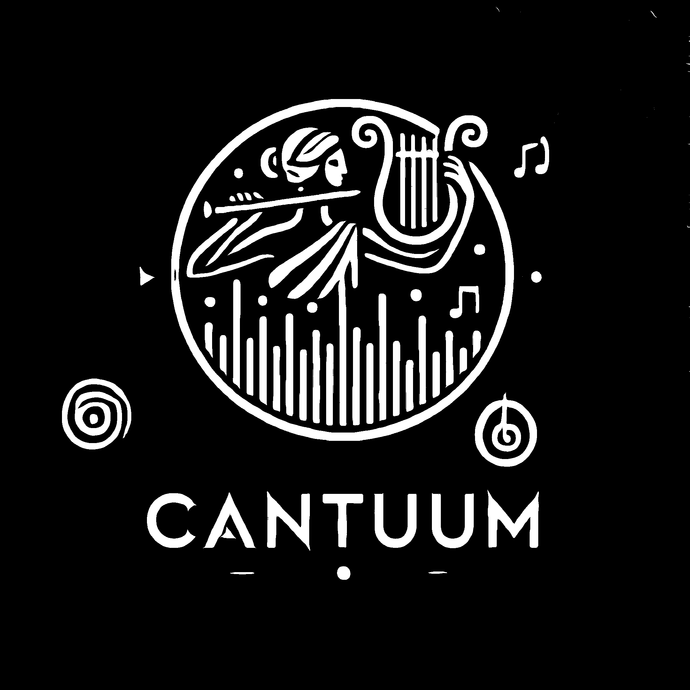

# Cantuum

<p align="center">
  
</p>

A decentralized peer-to-peer music streaming platform that connects artists directly with listeners, eliminating traditional platform intermediation. Built with modern web technologies and blockchain integration, Cantuum enables direct music streaming and monetization while operating as a public good with no middleman fees.

## 🎯 Core Philosophy

- **Pure P2P Streaming**: Direct streaming between artists and listeners
- **No Middleman Fees**: All payments remain peer-to-peer
- **Artist Control**: Full control over content and payment methods
- **Public Good**: Built and maintained as a transparent, sustainable public good
- **Direct P2P**: Verifiable on-chain records with direct peer-to-peer payments

## 🎵 Key Features

### Multi-Chain Wallet Integration
- **Polkadot (DOT)**: Using Polkadot.js extension
- **Ethereum (ETH)**: MetaMask integration
- **Cardano (ADA)**: Nami wallet support
- **Kusama (KSM)**: Via Polkadot.js extension
- **Tezos (XTZ)**: Using Temple wallet via Beacon protocol
- **Solana (SOL)**: Phantom wallet integration
- **Bitcoin (BTC)**: Lightning Network integration (in progress)
- **Avalanche (AVAX)**: Core wallet (pending)
- **Algorand (ALGO)**: MyAlgo wallet (pending)
- **Cosmos (ATOM)**: Keplr wallet (pending)

### Content Management
- Decentralized storage options:
  - IPFS
  - Arweave
  - Nostr
- Full artist control over content
- No platform-hosted files

### Artist Features
- Blockchain-based verification system
- Multi-wallet payment options
- Collaborator split payments
- Content encryption options
- Direct fan engagement

### User Experience
- Modern, responsive design
- Dynamic background animation
- Seamless payment integration
- Cross-chain compatibility
- Intuitive wallet connection

## 🛠 Tech Stack

### Frontend
- **Core**:
  - TypeScript
  - React 18
  - Vite
  - Emotion (styled components)

- **Blockchain Integration**:
  - @polkadot/api & extension-dapp
  - ethers.js
  - Cardano SDK
  - Buffer/Stream polyfills

- **Storage**:
  - IPFS HTTP Client
  - Arweave Integration
  - Nostr Protocol Support

### Backend (In Development)
- Rust
- WebAssembly support
- High-performance audio processing
- Decentralized storage coordination

## 🚀 Getting Started

1. Clone the repository:
   ```bash
   git clone https://github.com/yourusername/cantuum.git
   cd cantuum
   ```

2. Install dependencies:
   ```bash
   npm install
   ```

3. Start the development server:
   ```bash
   npm run dev
   ```

4. Open http://localhost:3000 in your browser

## 🤝 Contributing

We welcome contributions! Please feel free to submit a Pull Request.

## 📜 License

This project is licensed under the MIT License - see the [LICENSE](LICENSE) file for details.

## 🌟 Core Benefits

- No new blockchain needed
- No smart contracts required
- Verifiable on-chain records
- Direct P2P payments
- Artist control of content
- Transparent operations
- Sustainable public good model

## 🔗 Links

- [Documentation](https://docs.cantuum.com) (Coming soon)
- [Community](https://discord.gg/cantuum) (Coming soon)
- [Twitter](https://twitter.com/cantuum) (Coming soon)

## Development Status

### Completed
- Basic application structure
- Theme system implementation
- Network selection interface
- Wallet connection system
- Multiple wallet integrations (DOT, ETH, ADA, KSM, XTZ, SOL)
- Registration flow foundation

### In Progress
- Bitcoin Lightning integration
- Profile management system
- Content storage integration
- Artist verification system

### Planned
- Remaining wallet integrations (AVAX, ALGO, ATOM)
- Content player interface
- Payment processing
- Artist dashboard
- Listener interface

## Getting Started

### Prerequisites
- Node.js
- npm or yarn
- Web browser with wallet extensions installed

### Installation
```bash
# Clone the repository
git clone [repository-url]

# Install dependencies
npm install

# Start development server
npm run dev
```

### Supported Wallets
- Polkadot.js Extension
- MetaMask
- Nami
- Temple
- Phantom
- More coming soon...

## Contributing
Contributions are welcome! Please read our contributing guidelines for details.

## License
[License details to be added]
